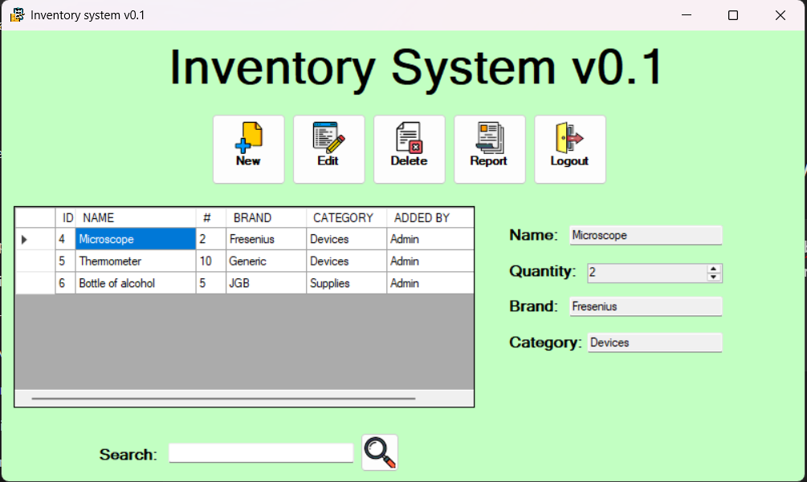

# 🏥 Inventory System v0.1

A simple inventory system for managing biomedical equipment.  
Allows adding, editing, deleting, searching, and exporting equipment data to Excel reports.



## ✨ Features

- 📋 **Full CRUD** (Create, Read, Update, Delete)
- 🔍 **Search** by equipment name
- 📊 **Generate Excel reports**
- 🏷️ Displays:
  - Equipment Name
  - Quantity
  - Brand
  - Category
  - User who added the item

## ⚙️ Technologies Used

- **Language:** C# (.NET Framework 4.7.2)
- **UI Framework:** WPF (Windows Presentation Foundation)
- **Database:** SQLite 3
- **ORM:** Entity Framework 6.4.4
- **Reporting:** Microsoft Reporting Services Report Viewer

## 📦 Main Dependencies

- `EntityFramework 6.4.4`
- `System.Data.SQLite 1.0.116.0`
- `Microsoft.ReportingServices.ReportViewerControl.Winforms 150.1537.0`

## 📐 Architecture

The system uses **Entity Framework 6** as an ORM to interact with an embedded SQLite database.  
The user interface is built with **WPF**, providing a simple and intuitive user experience.

## 🚀 How to Run

1. Clone the repository:
    ```bash
    https://github.com/santidev21/inventory-system.git
    ```
2. Open the solution in Visual Studio.
3. Restore NuGet packages.
4. Run the project.

## 🗂️ System Structure

- **Main Window:** Displays the inventory table.
- **CRUD Forms:** Add/Edit forms for inventory items.
- **Reporting Module:** Exports data to Excel.

## 📝 Additional Notes

This project was developed as a personal exercise to practice WPF and working with local databases using SQLite.  
While it is focused on biomedical equipment, it can easily be adapted for any type of inventory management.

